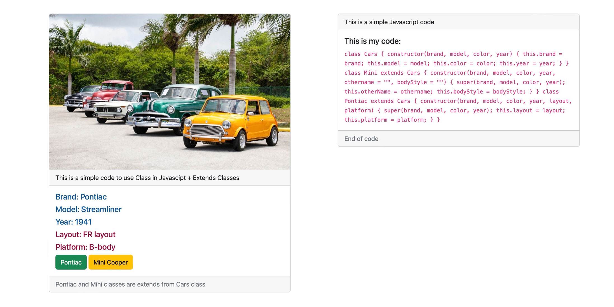

<div>
  <h1 align="center">Classic Car Show -  is a Javascript Project 🧑‍💻</h1>
  <h1 align="center">For practicing javascript class(OOP)</h1>
<h3>Goals</h3>
  <ul>
    <li>
    Practicing Javascript Classes
  </li>
  <li>
    Practicing addEventListener()
  </li>
  <li>
    Practicing querySelector()
  </li>

   </ul>

  <p>
    Screenshot:
  </p>

  <a href="">
    
  </a>
</div>

<hr />


## Requirements
- Javascript

## Main Part

- Classes


```javascript
class Cars {
    constructor(brand, model, color, year) {
        this.brand = brand;
        this.model = model;
        this.color = color;
        this.year = year;
    }
}

class Mini extends Cars {
    constructor(brand, model, color, year, othername = "", bodyStyle = "") {
        super(brand, model, color, year);
        this.otherName = othername;
        this.bodyStyle = bodyStyle;
    }

}

class Pontiac extends Cars {
    constructor(brand, model, color, year, layout, platform) {
        super(brand, model, color, year);
        this.layout = layout;
        this.platform = platform;
    }
}
```
# Just open index.html with a Browser
# JavaScript codes are in app.js